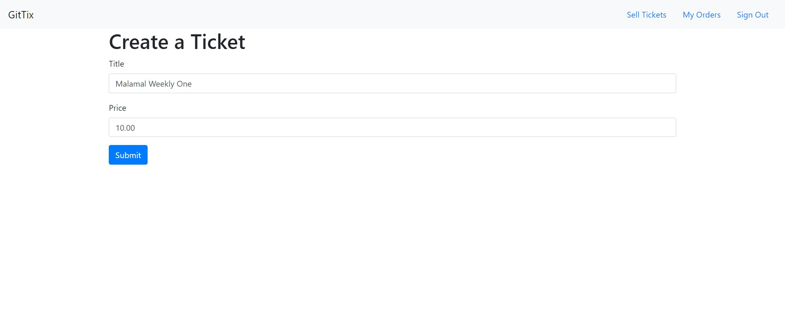

# Microservice :: Ticket booking app 
Microservice app managed by docker+kubernetes to book online tickets.

## Has Fllowing tech-stack and features
- Distributed microservices running that serves NodeJS backend APIS.
- Uses Docker and Kubernetes to handle local as well as cloud deployement of all microservices.
- Uses Nats Streaming services to sync messages between multiple microservices to enable realtime failsafe horizonatlly scalled pub/sub sync link.
- Has order timeout mechanism to cancel order in certain timeout.
- Stripe payment service api implementation.
- Uses scaffold to handle local realtime development.
- Backend Implemented in Typescript
- Frontend Implemented in NextJS framework

## Microservice Infrastructure.

## Frontend Screeshots

